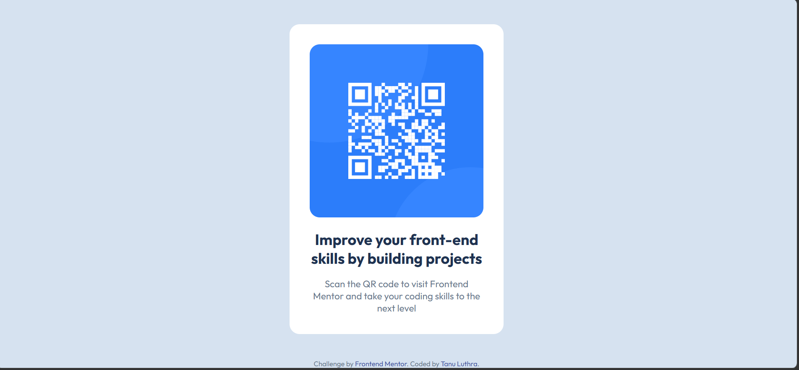

# Frontend Mentor - QR code component solution

This is my solution to the [QR code component challenge](https://www.frontendmentor.io/challenges/qr-code-component-iux_sIO_H) on Frontend Mentor.

## Overview

### Screenshot



### Links

- Solution URL: [GitHub](https://github.com/tanuluthra4/qr-code)
- Live Site URL: [Live Demo](YOUR_LIVE_SITE_URL)

## My process

### Built with

- Semantic HTML5 markup
- CSS
- Flexbox
- Google Fonts
- Responsive layout

### What I learned

This was my first Frontend Mentor project, and I focused on understanding the fundamentals rather than using a framework.

I practiced:

- Using semantic HTML elements such as `main`, `h1`, `p`, and `footer`
- Loading and using the Outfit font
- Using Flexbox to center and position elements
- Understanding the CSS box model
- Using `box-sizing: border-box`
- Managing spacing and text wrapping
- Building a layout that works across different viewport sizes

One useful pattern I learned was:

```css
* {
  box-sizing: border-box;
  margin: 0;
  padding: 0;
}
```

Using border-box makes the declared width include padding and borders, which made the card dimensions easier to control.

### Continued development

In future Frontend Mentor projects, I want to improve my understanding of:

- Responsive layouts
- CSS Grid
- CSS custom properties
- Accessibility
- More advanced Flexbox and CSS layout techniques

I also want to become more comfortable translating a design into CSS without relying on trial and error.

### Useful resources

- [Frontend Mentor](https://www.frontendmentor.io/) - Used the challenge brief and design reference.
- [Google Fonts](https://fonts.google.com/specimen/Outfit) - Used the Outfit typeface.

### AI Collaboration

I used ChatGPT as a learning and debugging companion during this project.

I used it to:

- Debug HTML and CSS issues
- Understand Flexbox behavior
- Understand the CSS box model
- Reason about layout problems
- Review implementation decisions

The goal was to understand the underlying concepts rather than directly copy a finished solution.

## Author

- GitHub - [@tanuluthra4](https://github.com/tanuluthra4)
- Frontend Mentor - [@tanuluthra4](https://www.frontendmentor.io/profile/tanuluthra4)

## Acknowledgments

Thanks to Frontend Mentor for providing the challenge and design resources.
